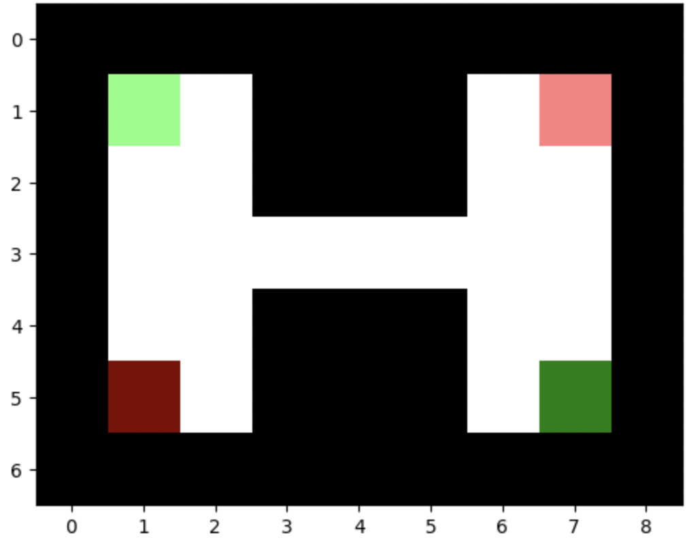
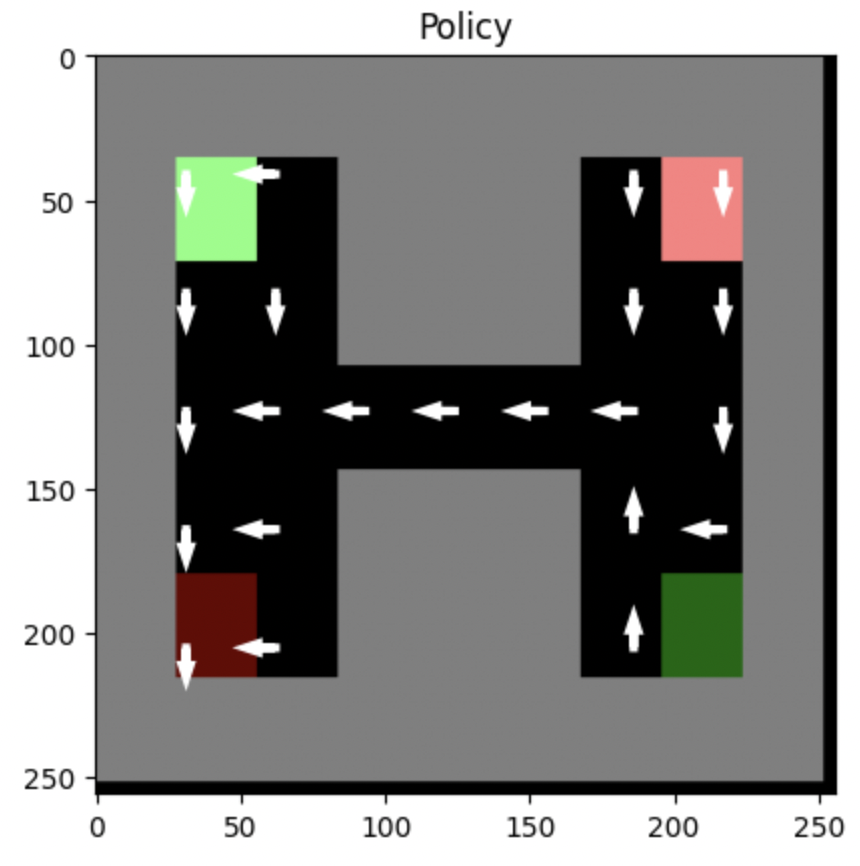

# Multi-Agent Distral

This is the repository for our Multi-Agent AI Project. We extend the Multi-Task single-agent Distral algorithm from [Distral: Robust Multitask Reinforcement Learning](https://proceedings.neurips.cc/paper_files/paper/2017/file/0abdc563a06105aee3c6136871c9f4d1-Paper.pdf) to a Multi-Task Multi-Agent setting in a cooperative environment.
<be><br>
The Presentation for our project can be found [here](https://www.canva.com/design/DAF_wsWGmqk/PjoC2GEOzvUYo8rPZqR9lw/edit).

```
├── algorithms          # implementation of baseline and multi-agent algorithms
|   ├── MultiDistral
|   |   ├── MultiDistral_E_step
|   |   |   ├── Soft_Q_Learning_without_rollout.py   # Soft Q-Learning without rollout
|   |   ├── MultiDistral.py #
|   ├── Q_Learning.py                          # Q-Learning baseline
|   ├── Q_learning_rollout.py
|   ├── Soft_Q_Learning_Baseline.py            # Soft Q-Learning with 10-step rollout
|   ├── Soft_Q_Learning_without_rollout.py
|   ├── maddpg.py                               # MADDPG 
├── tasks                                     # n tasks for MultiTask RL (Distral Implementation)
|   ├── task1.txt
|   ├── task2.txt
|   ├── task3.txt
|   ├── task4.txt
|   ├── task5.txt
|   ├── task6.txt
├── GridWorld-Test.ipynb    # GridWorld Env plots and simulation
├── MCTS.py                 # Monte Carlo Tree Search 
├── MultiDistral.ipynb      # Multi-Distral Tests
├── environment.yml         # installing dependencies 
├── gridworld_env.py          
├── new_gridworld.ipynb
├── maddpg.ipynb
├── plotting.py             # plotting utils
├── render_animation.py     # animation utils
├── soft_q-learning_test.py  
├── testing.ipynb           # q-learning policy plots and render animation
```

## The Environment:

A visual render of our environment (lighter color is the agent's starting position and the darker color is its target position):

<div style="display: flex; justify-content: center;">

</div>

<br>
Q-Learning baseline policy plot:

<div style="display: flex; justify-content: center;">

</div>
