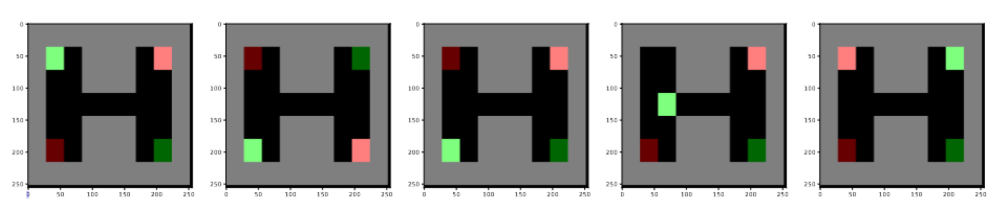

# MultiDistral

This repository contains the code for MultiDistral, a multi-agent implementation of Distral (Teh et al., 2017).
The MultiDistral implementation tries to solve the following grid environments:



The light green square is agent 1, the pink square is agent 2. The corresponding darker squares are each agent's target.
Essentially, the challenge is to coordinate which agent can pass through the tunnel, a task only possible if one agent
learns to wait and thus cooperate.

## Table of Contents

- [Installation](#installation)
- [Usage](#usage)
- [Acknowledgments](#acknowledgments)

## Installation

Conda is required to run the project. Execute the following commands from terminal:

```bash
git clone https://github.com/maxjappert/multi-agent_distral.git
cd multi-agent_distral
conda env create -f environment.yml
```

## Usage

The baseline algorithms can be tested in the `testing.ipynb` notebook. MultiDistral can be tested in the `MultiDistral.ipynb` notebook.
The `algorithms` folder contains the implementations of the baseline algorithms. The nested `algorithms/MultiDistral` folder contains
the MultiDistral implementation, including the soft q-learning algorithm used in Distral's e-step. The `tasks` folder contains the tasks
(i.e. the grid environments) as text files. The `plotting.py` and `render_animation.py` are used for visualising the results.
`maddpg.ipynb` is an attempt at implementing MADDPG for the given environments, yet it doesn't work and is not considered
in the report.

## Acknowledgements

`maddpg.ipynb` authered by Vishrut Malik, the rest authered by Samuel Oliveira and Max Jappert. Implemented as
part of the Multi-Agent Artificial Intelligence (COMP0124) course taught by Professor Jun Wang at University College London.